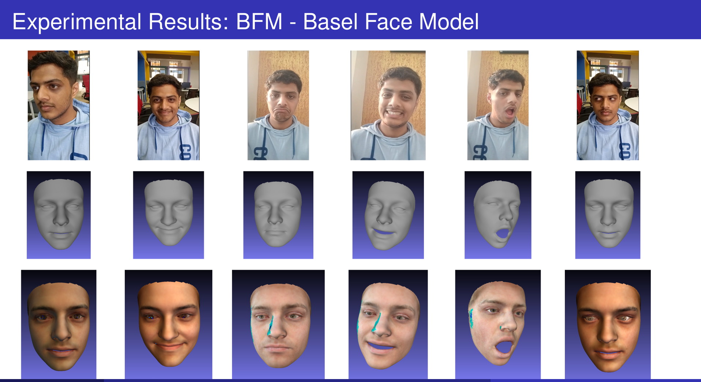
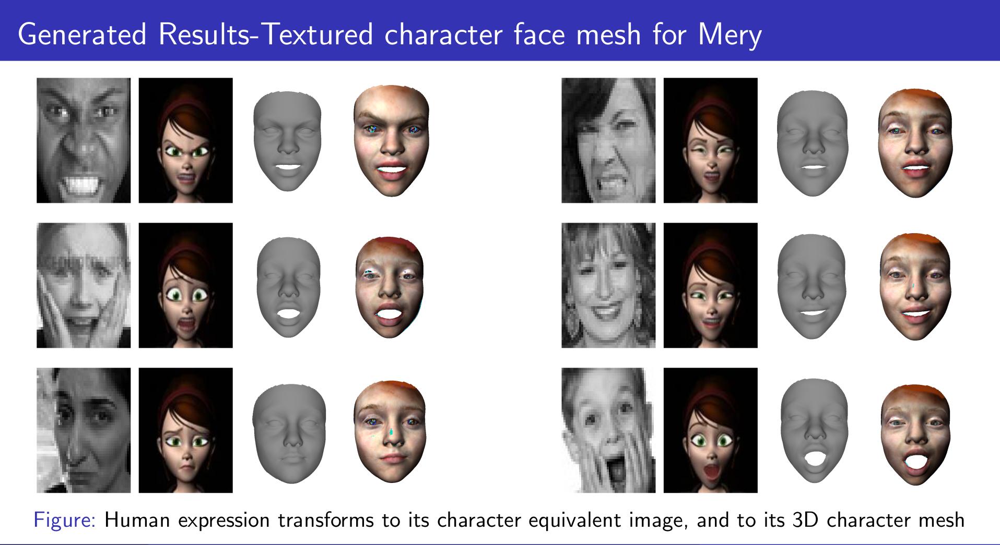

Human-to-3D avatar retargeting focuses on mapping facial expressions and deformations from a human face to a 3D avatar. This process involves using Delaunay's triangulation to manage facial mesh deformation and ensure accurate real-time updates. Tools like the Mediapipe face model and the Basel face model play crucial roles in capturing and representing facial features. The Mediapipe model helps in detecting and tracking facial landmarks, while the Basel model provides a robust 3D facial mesh that can be adjusted based on the triangulation results. This technology allows for seamless and dynamic facial expression transfer from real-time human inputs to 3D avatars.

In advancing 3D stylized character expressions, research has focused on generating expressive 3D characters from human inputs. By employing variational autoencoders to learn and generate latent spaces of human and character expressions, researchers can map these latent spaces to derive correspondences. A Multi-Layer-Perceptron (MLP) is then trained to align these correspondences, facilitating the generation of stylized character expressions. The Basel Face Model is used for 3D mesh generation.

These leverage a tech stack comprising Python, OpenCV, and PyTorch to create 3D meshes that reflect a range of expressions.

Results:

